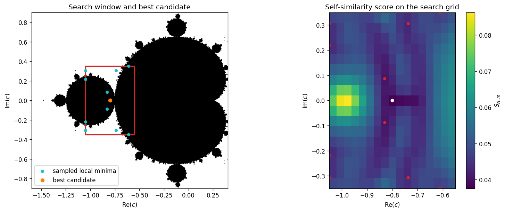
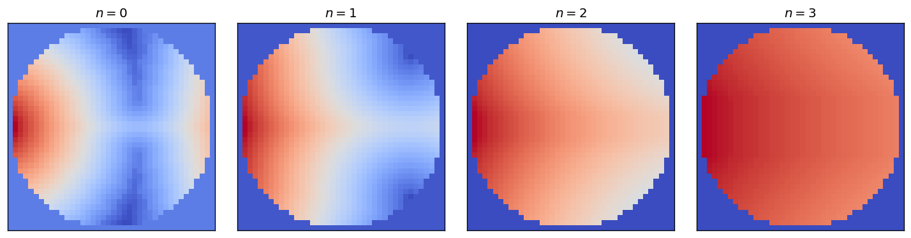

# Search for a pattern experimentally?

Following Dudko, Lyubich, and Selinger, *Pacman renormalization and self-similarity of the Mandelbrot set near Siegel parameters* ([arXiv:1703.01206](https://arxiv.org/abs/1703.01206)), it might be interesting to use image processing techniques to automatically locate interesting patterns. In Section 1.1 they describe self-similarity features of the Mandelbrot set near its main cardioid; more precisely, near the (anti-)golden mean point, the $(p_n/p_{n+2})$-limbs of $M$ scale down at rate

$$
\lambda^{-2n},
$$

where

$$
\lambda = \frac{1+\sqrt{5}}{2},
$$

and $p_n$ are the Fibonacci numbers. The stated goal there is to develop a renormalization theory responsible for this phenomenon.

Fix a bounded rectangle $B \subset \mathbb{C}$ containing $\mathcal{M}$. For each integer $N \geq 1$, let $I_N$ be the binary image obtained by sampling membership in $\mathcal{M}$ at the centers of an $N \times N$ square grid in $B$. A related problem is to determine whether prescribed geometric or combinatorial patterns in $\mathcal{M}$ can be detected algorithmically from the family of finite-resolution approximations $(I_N)_{N \geq 1}$.

## Known related works

- Dudko, Lyubich, and Selinger, *Pacman renormalization and self-similarity of the Mandelbrot set near Siegel parameters* ([arXiv](https://arxiv.org/abs/1703.01206), [local PDF](./refs/pacman%20renormalization%201703.01206v3.pdf)).
- Dudko and Lyubich, *Local connectivity of the Mandelbrot set at some satellite parameters of bounded type* ([arXiv](https://arxiv.org/abs/1808.10425), [local PDF](./refs/dudko-lyubich-local-connectivity-1808.10425.pdf)).
- McMullen, *Self-similarity of Siegel disks and Hausdorff dimension of Julia sets* ([arXiv](https://arxiv.org/abs/math/9805097), [local PDF](./refs/mcmullen-self-similarity-siegel-disks-math9805097.pdf)).
- Chéritat, *Near parabolic renormalization for unicritical holomorphic maps* ([arXiv](https://arxiv.org/abs/1404.4735), [local PDF](./refs/cheritat-near-parabolic-renormalization-1404.4735.pdf)).
- Gaidashev and Yampolsky, *Renormalization of almost commuting pairs* ([arXiv](https://arxiv.org/abs/1604.00719), [local PDF](./refs/gaidashev-yampolsky-almost-commuting-pairs-1604.00719.pdf)).
- Lyubich, *Conformal Geometry and Dynamics of Quadratic Polynomials* ([author PDF](https://www.math.stonybrook.edu/~mlyubich/book.pdf), [local PDF](./refs/lyubich-conformal-geometry-dynamics-quadratic-polynomials.pdf)).

## Existing attempts to search for patterns

Existing attempts appear to fall into three classes.

First, the main rigorous literature studies recurrent structure in $\mathcal{M}$ by dynamical and renormalization methods rather than by direct image analysis. The works of McMullen, Dudko--Lyubich--Selinger, Dudko--Lyubich, Chéritat, Gaidashev--Yampolsky, and Lyubich belong to this class. They locate and explain self-similar features, scaling laws, and renormalization patterns by analytic and combinatorial arguments, not by template matching on finite rasterizations.

Second, there are computer-assisted search procedures implemented in fractal-exploration software. These methods are designed to locate minibrots, nuclei, or related distinguished parameters by using the dynamics of the defining iteration, for example Newton-type refinement or other parameter-space search heuristics. Such procedures constitute genuine algorithmic pattern search, but they are not generic computer-vision methods applied to the sampled images $(I_N)_{N \geq 1}$.

Third, one finds experimental and machine-learning work on fractal images more generally, including clustering, classification, and synthetic-dataset constructions. However, a systematic literature devoted specifically to detecting mathematically meaningful Mandelbrot patterns from finite-resolution images by image-processing methods appears to be sparse.

Accordingly, the problem formulated above seems to remain largely open in its purely image-based form: the closest existing work is either rigorous renormalization theory or software-assisted dynamical search, rather than a developed theory of pattern detection from the pixel approximations $(I_N)_{N \geq 1}$ alone.

## The golden-scale self-similarity functional

Fix a compact set $U \subset B$, an integer $m \geq 1$, and a number $r_0 \gt 0$ such that

$$
U + r_0 \overline{\mathbb{D}} \subset B,
$$

where $\mathbb{D} = \lbrace z \in \mathbb{C} : |z| \lt 1 \rbrace$. Let

$$
\lambda = \frac{1+\sqrt{5}}{2},
\qquad
r_n = r_0 \lambda^{-2n},
\qquad 0 \leq n \leq m.
$$

Let $\widehat{I}_N \colon B \to \lbrace 0,1 \rbrace$ be the piecewise-constant extension of $I_N$, and define

$$
\delta_N(z) = \operatorname{dist}\bigl(z,\widehat{I}_N^{-1}(0)\bigr) - \operatorname{dist}\bigl(z,\widehat{I}_N^{-1}(1)\bigr), \qquad z \in B.
$$

For $x \in U$ and $0 \leq n \leq m$, define

$$
f_{N,x,n}(u) = r_n^{-1}\delta_N(x+r_n u), \qquad u \in \overline{\mathbb{D}}.
$$

For $1 \leq n \leq m$, define

$$
E_{N,n}(x) = \inf_{\theta \in [0,2\pi)} \bigl\lVert f_{N,x,n} - f_{N,x,0}(e^{i\theta}\cdot) \bigr\rVert_{L^2(\overline{\mathbb{D}})}.
$$

Define the golden-scale self-similarity functional

$$
S_{N,m}(x) = \sum_{n=1}^m 2^{-n} E_{N,n}(x), \qquad x \in U.
$$

Define the candidate set

$$
\mathcal{C}_{N,m,\tau} = \lbrace x \in U : S_{N,m}(x) \leq \tau \rbrace, \qquad \tau \gt 0,
$$

and define

$$
x_{N,m} \in \mathop{\mathrm{argmin}}\limits_{x \in U \cap \Gamma_N} S_{N,m}(x),
$$

where $\Gamma_N$ is the sampling grid of $I_N$. The points in this candidate set, or equivalently the minimizers of the functional on $U \cap \Gamma_N$, are the outputs of the search procedure.

## Experimental golden-scale search

The notebook [./notebooks/golden_scale_self_similarity.ipynb](./notebooks/golden_scale_self_similarity.ipynb) implements a discrete version of the golden-scale self-similarity functional. In the current experiment it:

1. samples a binary image of the Mandelbrot set on a finite grid;
2. constructs the associated signed distance field;
3. evaluates the score $S_{N,m}$ on a search window near the main cardioid;
4. lists all sampled local minima of the score on that finite grid.

In the current run, the best sampled candidate is near

$$
c = -0.8,
$$

with score approximately

$$
S_{N,m} \approx 0.037588.
$$

On the chosen finite grid, the detected candidate set is finite. In the grid-based formulation over the countable family of finite sampling grids $(\Gamma_N)_{N \geq 1}$, the union of all sampled candidate sets is therefore at most countable.

At present, this experiment is only qualitatively consistent with the Dudko-style theory: it does find low-score multiscale candidates near the main cardioid, so the functional is detecting the intended kind of self-similarity. However, it does not yet isolate the specific (anti-)golden mean point, nor does it verify the scaling law

$$
r_n \asymp \lambda^{-2n}
$$

in any rigorous or high-precision sense. It should therefore be interpreted as a proof of concept for the detection functional, not as a confirmation of the full theory.

### Search window, sampled local minima, and score field

The left panel shows the search window together with all sampled local minima and the best candidate. The right panel shows the corresponding score field $S_{N,m}$ on the search grid. The presence of several low-score points is qualitatively compatible with the expectation that self-similar loci occur near the main cardioid, but this picture alone does not identify the Dudko point or establish the predicted asymptotic scaling.

### Normalized patches across golden scales

These patches are the normalized fields $f_{N,x,n}$ at scales

$$
r_n = r_0 \lambda^{-2n},
\qquad
n = 0,1,2,3.
$$

Their visual similarity is the experimental signal that the functional is designed to detect. In the current notebook this is only a finite-resolution visual and numerical proxy for the theoretical pattern.

## Current non-golden candidates found experimentally

In the executed notebook search over alternative ratios, the numerical parameters were fixed as follows:

$$
B = [-1.6,0.4] \times [-0.9,0.9],
\qquad
U = [-1.05,-0.55] \times [-0.35,0.35],
$$

$$
N = 320,
\qquad
m = 3,
\qquad
r_0 = 0.18,
$$

with the functional

$$
S_{N,m}^{(\alpha)}(x)
$$

defined by the rule

$$
r_n = r_0 \alpha^{-2n}.
$$

For each tested ratio $\alpha$, let

$$
x^{\ast}(\alpha) \in \mathop{\mathrm{argmin}}\limits_{x \in U \cap \Gamma_N} S_{N,m}^{(\alpha)}(x),
$$

where $\Gamma_N$ is the sampling grid. The following candidates were found.

### Family 1

For

$$
\alpha \in \lbrace 1+\sqrt{2}, \frac{3+\sqrt{13}}{2}, 2+\sqrt{5}, [1,2,1,2,\ldots] \rbrace,
$$

the minimum value among the tested ratios was attained at

$$
\alpha = [1,2,1,2,\ldots] = \frac{1+\sqrt{3}}{2} \approx 1.366025,
$$

with

$$
x^{\ast}(\alpha) = (-0.8,0),
\qquad
S_{N,m}^{(\alpha)}(x^{\ast}(\alpha)) \approx 0.032690.
$$

### Family 2

For the metallic means

$$
\sigma_k = \frac{k+\sqrt{k^2+4}}{2},
\qquad 2 \leq k \leq 6,
$$

the smallest value was attained at

$$
\sigma_2 = 1+\sqrt{2} \approx 2.414214,
$$

with

$$
x^{\ast}(\sigma_2) = (-0.8,0),
\qquad
S_{N,m}^{(\sigma_2)}(x^{\ast}(\sigma_2)) \approx 0.042416.
$$

### Family 3

For the tested periodic continued fractions

$$
[1,2,1,2,\ldots], \quad [1,3,1,3,\ldots], \quad [2,3,2,3,\ldots], \quad [1,1,2,1,1,2,\ldots], \quad [2,2,1,2,2,1,\ldots],
$$

the smallest value was attained at

$$
\alpha = [1,3,1,3,\ldots] = \frac{1+\sqrt{13}}{2} \approx 1.263763,
$$

with

$$
x^{\ast}(\alpha) = (-0.8,0),
\qquad
S_{N,m}^{(\alpha)}(x^{\ast}(\alpha)) \approx 0.029201.
$$

### Family 4

For the coarse interval scan

$$
\alpha \in \lbrace 1.25, 1.35, 1.50, 1.75, 2.00, 2.50, 3.00, 4.00 \rbrace,
$$

the smallest value was attained at

$$
\alpha = 1.25,
$$

with

$$
x^{\ast}(1.25) = (-0.8,0),
\qquad
S_{N,m}^{(1.25)}(x^{\ast}(1.25)) \approx 0.028634.
$$

Thus, among all ratios tested so far in the non-golden notebook, the smallest observed value was

$$
S_{N,m}^{(1.25)}((-0.8,0)) \approx 0.028634.
$$

In all four tested families, the best candidate lies on the real axis, and in three of the four families the minimizing sampled point is exactly

$$
(-0.8,0).
$$

## Next step: search for other scaling ratios

A natural next step is to replace the golden scaling law by a more general one

$$
r_n = r_0 \alpha^{-2n},
\qquad \alpha \gt 1,
$$

and define the corresponding family of functionals

$$
S_{N,m}^{(\alpha)}(x).
$$

One may then search either over a finite set of prescribed values of $\alpha$ or over a discretized interval of possible ratios. The most natural first candidates are:

- the silver ratio $1+\sqrt{2}$;
- more generally the metallic means $\sigma_k = \frac{k+\sqrt{k^2+4}}{2}$, where $k \geq 1$;
- quadratic irrationals coming from periodic continued fractions;
- ratios derived from denominators of convergents of bounded-type rotation numbers;
- Feigenbaum-type scaling constants in other renormalization regimes.

Thus the present golden-scale notebook can be regarded as the first member of a broader experimental program of searching for self-similar loci by minimizing $S_{N,m}^{(\alpha)}(x)$ over both $x$ and $\alpha$.
